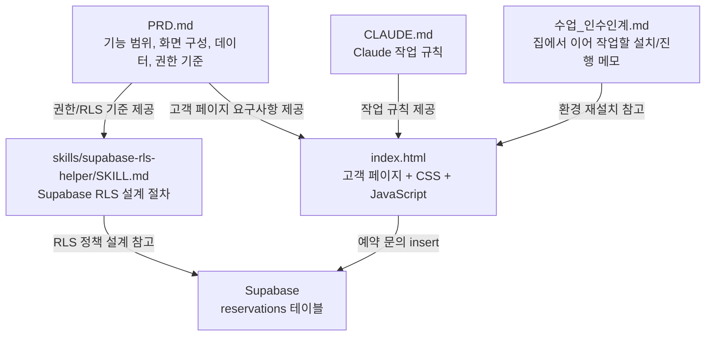
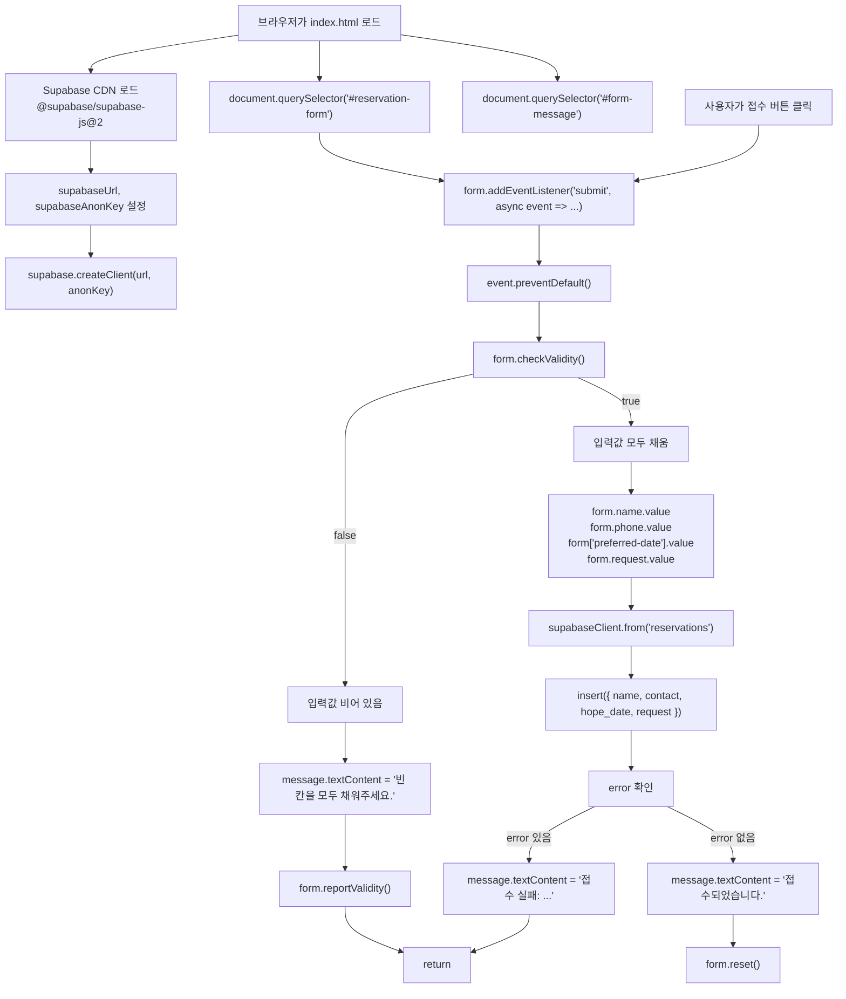
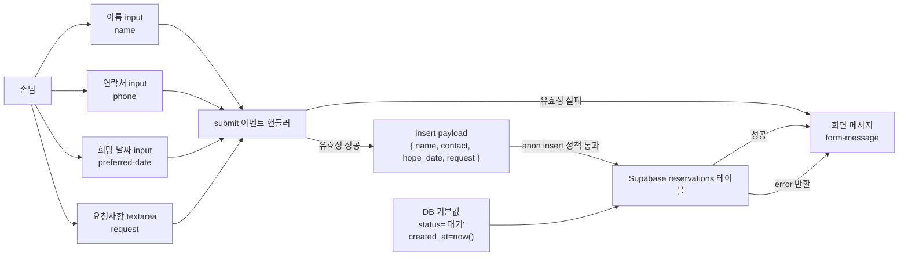
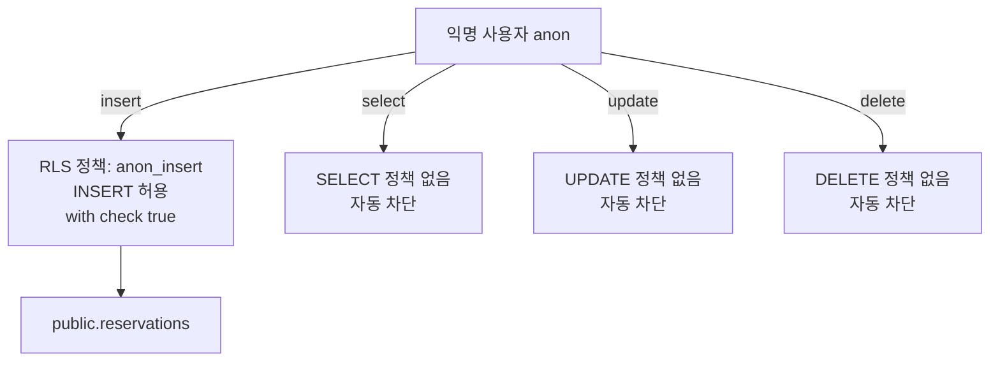

# 프로젝트 전체 흐름 다이어그램

이 문서는 현재 프로젝트의 모든 파일, 실행 함수, 함수 간 호출 관계, 데이터 이동을 Mermaid 형식으로 정리한 문서입니다.

## 파일 관계

## index.html 함수 호출 관계

## 데이터 이동

## Supabase 권한 흐름

## 현재 실행 함수 목록

| 파일 | 함수/호출 | 역할 |
|---|---|---|
| `index.html` | `supabase.createClient()` | Supabase 클라이언트 생성 |
| `index.html` | `document.querySelector()` | 폼과 메시지 요소 찾기 |
| `index.html` | `form.addEventListener('submit', async event => ...)` | 접수 버튼 클릭 처리 |
| `index.html` | `event.preventDefault()` | 기본 폼 제출 막기 |
| `index.html` | `form.checkValidity()` | 필수 입력값 확인 |
| `index.html` | `form.reportValidity()` | 브라우저 기본 경고 표시 |
| `index.html` | `supabaseClient.from('reservations').insert()` | 예약 문의 DB 저장 |
| `index.html` | `form.reset()` | 성공 후 폼 초기화 |

